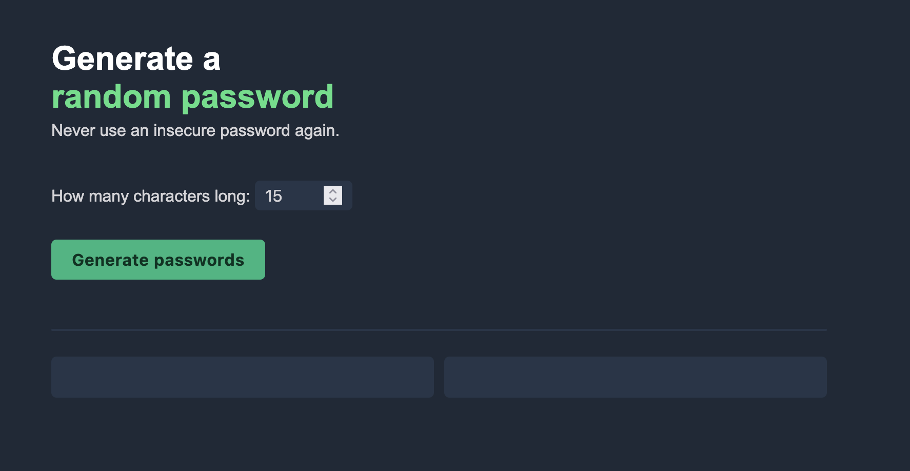

# Password Generator

This is a simple Single Page Application (SPA) that generates two random passwords based on the user’s desired length.

## Features

- User input for password length
- Generates two random passwords
- Click to copy the password to your clipboard
- Simple and clean UI using HTML, CSS, and JavaScript

## Technologies Used

- HTML
- CSS
- JavaScript

## How to Use

1. Open the application in a web browser: https://tavion-password-generator.netlify.app
2. Enter the desired password length in the input field.
3. Click the "Generate Passwords" button.
4. Two random passwords will be displayed.
5. Click on a password to copy it to the clipboard.

## Preview

